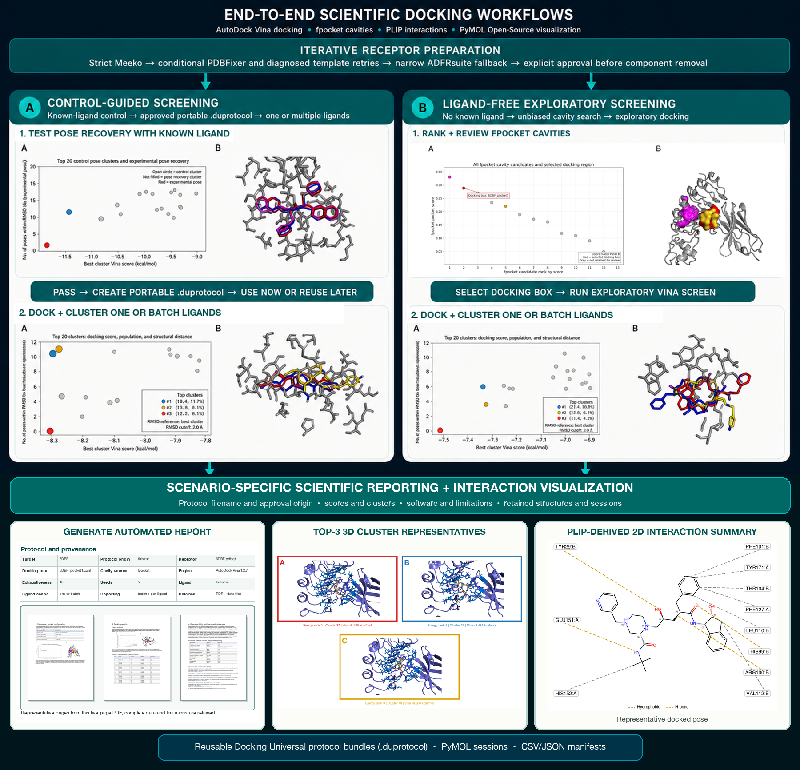

# Docking Universal

**Current research-preview release: v0.6.0**

**Docking Universal is a scientific workflow orchestration, validation, analysis, visualization, and reporting system built around AutoDock Vina and established open-source structural-bioinformatics tools.**

It provides one guided, interactive command-line interface for control-guided or ligand-free docking studies while retaining configurable, independently composable commands for scripted use, complete provenance, PyMOL Open-Source visualizations, and automatic scientific PDF reports.

Every automated workflow decision is traceable through retained parameters, manifests, intermediate artifacts, and raw tool logs. A guided interface should make clear when a step rests on an assumption or requires scientific judgment, rather than allowing convenience to imply certainty. When chemistry or structural ambiguity falls outside the workflow's defined automation boundaries, Docking Universal stops, explains the issue, and requests explicit user review instead of silently guessing or modifying the molecular model. The user's selection, approval, or documented override—and the context that required it—is retained as part of the audit trail.

**AutoDock Vina performs the actual docking search and scoring.** Docking Universal does not introduce a new docking engine or scoring function; it makes the surrounding multi-tool scientific workflow reproducible, reviewable, batch-capable, and easier to run without launching each script manually.

In short: **Vina docks; Docking Universal makes the surrounding scientific workflow reproducible and reviewable.** AutoDock Vina is the only docking engine supported in this research preview. A smina comparison backend may be evaluated for a later version, but it is not part of the current installation or interface.

The current release supports **rigid-receptor docking only**: receptor coordinates remain fixed during each Vina search. Prepared ligand torsions may remain flexible, and independent ligand conformers can be searched, but receptor side-chain or backbone flexibility is not modeled. The guided runner accepts a multi-record SDF or a directory of SDF files for batch docking, with one isolated result folder per compound.

It consolidates a series of working research scripts behind one consistent command while retaining the provenance and diagnostics that made the original workflow auditable.

The project was created in part to make this compiled scientific toolchain practical and reproducible across supported Unix-like systems. Current automated testing covers macOS and Ubuntu; portability to other platforms remains a tested goal rather than an assumed guarantee.

## Why I built it: a scientist's perspective

Docking Universal began with a practical scientific question: **how should I determine where to dock?** While building it, I learned how many consequential assumptions can sit behind an apparently straightforward docking result. I wanted a practical end-to-end workflow that would not hide those choices: automated decisions remain auditable, and ambiguity prompts documented user review rather than silent guesses. [Read more about why the workflow is designed this way](docs/design-philosophy.md).

## Project status

**Research preview.** The core workflow has produced useful outputs across tested structural-docking cases on macOS and Ubuntu. A matched public 1HVR/XK2 case passes raw preparation, ligand-free pocket recovery, Vina execution, score collection, PLIP processing, and visual rendering. Its five-seed Vina ensemble control passed the target-specific 2 Å sampling/ranking rule. This single retrospective case is not broad accuracy validation. See [Validation](docs/validation.md).

**Preparation validation and limitations.** Two 50-PDB public receptor-preparation cohorts (a general sample and a deliberately difficult covalent-linkage panel) have been tested. Known limitations include some covalent adducts, linked glycans, metals/heme, modified backbones, and nucleic-acid complexes. Complete outcomes, retained test evidence, safeguards, and documented failures are in the [100-PDB receptor-preparation validation record](docs/receptor-preparation-validation-2026-08-21.md) and [validation index](docs/validation.md).



## Example scientific reports

[View a complete current-style PDF report](docs/assets/docking-universal-example-report.pdf).

Docking Universal produces scenario-specific reports for:

- fresh bound-ligand control studies, with or without subsequent new-ligand docking;
- new compounds docked with an existing approved protocol;
- exploratory ligand-free cavity selection, with or without subsequent docking;
- receptor preparation and cavity analysis without ligand docking; and
- single- or multi-ligand docking studies.

The linked example shows the current report organization, figures, tables, provenance, software-version recording, and scientific limitations. It demonstrates report format and workflow outputs; its individual docking results are not general validation of docking accuracy.

## Package map

| Stage | Command | Main outputs |
| --- | --- | --- |
| Guided study | `docking-universal run` | control, approved-screen, or exploratory workflow; per-compound folders; CSV/JSON/Markdown/HTML reports |
| Independent ensemble | `docking-universal ensemble` | pH-aware protomer/tautomer states and reproducible ETKDG/MMFF conformers |
| Bound-ligand control | `docking-universal control` | verified experimental-coordinate SDF, redocked poses, scores, pose RMSDs, PLIP/PyMOL visuals |
| Receptor + sites | `docking-universal prepare` | receptor PDB/PDBQT, ligand manifest, pocket diagnostics, Vina boxes, PyMOL scenes |
| Compound library | `docking-universal ligands` | optimized per-compound PDBQT files with name and SMILES metadata |
| Pocket coordinates | `docking-universal pockets` | ranked pocket coordinates, box PDBs, and configuration files |
| Batch execution | `docking-universal dock` | per-compound PDBQT models, logs, and run manifest |
| Result collation | `docking-universal collect` | tidy CSV preserving Vina score and RMSD-bound fields |
| Pose comparison | `docking-universal compare-redock` | symmetry-aware pose RMSDs, summary, complexes, and overlay scene |
| Control evaluation | `docking-universal evaluate-control` | sampling/ranking/seed acceptance and versioned protocol gate |
| Protocol-locked unknown | `docking-universal screen` | independent unknown-ligand ensemble, replicated poses, combined scores, audit manifest |
| Cross-run pose clustering | `docking-universal cluster-poses` | all-pose inventory, energy-ranked clusters, three representative scenes, seed/conformer support |
| Interactions | `docking-universal interactions` | PLIP XML/text, fixed coordinates, all-in-one PyMOL PML, manifest |
| 3D output | `docking-universal render3d` | headless PyMOL PNG from an existing PML or coordinate file |
| 2D output | `docking-universal depict2d` | generic PNG/SVG molecular depictions from existing coordinate files |

## Requirements

The dispatcher and file-processing commands require Bash 3.2+, Python 3, and standard Unix tools. Scientific dependencies are stage-specific:

- receptor and pocket preparation: Meeko `mk_prepare_receptor.py` plus `fpocket`, with ADFRsuite `prepare_receptor` as a legacy backend;
- ligand-library preparation: Open Babel (`obabel`) plus Meeko `mk_prepare_ligand.py`, with ADFRsuite `prepare_ligand` as a legacy backend;
- docking engine: AutoDock Vina in its isolated engine environment;
- interaction analysis: PLIP (`plip`), followed by Docking Universal's custom consolidated PyMOL-scene writer;
- 3D rendering: `pymol`;
- 2D rendering: RDKit when available, with Open Babel as a fallback.

Check what is visible on the current workstation:

```bash
./bin/docking-universal check-install
```

Only dependencies used by the selected stage are required.

The direct versions verified in a fresh macOS arm64 environment are pinned in [environment.yml](environment.yml), with a complete historical conda build snapshot in `environment-lock-osx-arm64.txt` and a Python distribution snapshot in `requirements-pip-lock.txt`. See the [installation guide](docs/installation.md) and [working scientific environment](docs/environment.md). Receptor preparation tries strict Meeko first and uses conservative PDBFixer repair only when the original receptor is rejected; ADFRsuite remains the legacy alternative backend. In a historical 50-structure public-PDB sample, 47/50 produced a PDBQT: 41 without unmatched-component removal, one after guided histidine-template selection, and five only through the former automatic Meeko cleanup that omitted unmatched components. The current workflow no longer performs that cleanup automatically: it stops, explains the issue, and requires explicit approval before any model-changing removal. Three structurally consequential cases stopped rather than silently deleting or guessing cofactors, linked polymers, or mixed protein–nucleic-acid chemistry.

## Install

### New to command-line scientific software

Git is not required just to try Docking Universal:

1. On the [Docking Universal GitHub page](https://github.com/thomaslane79-creator/docking-universal), select **Code**, then **Download ZIP**.
2. Extract the downloaded ZIP.
3. Install [Miniforge](https://github.com/conda-forge/miniforge) for your operating system if Conda is not already installed.
4. Open a terminal in the extracted `docking-universal` folder.
5. Run:

```bash
bash install.sh
docking-universal run
```

The installer explains each stage, creates both scientific environments, checks
the complete installation, and prints the command to begin. It does not require
you to activate or manage either Conda environment. The installed launcher runs
every subcommand in the correct environment automatically, including
`docking-universal prepare-ligand` and `docking-universal check-install`.
The guided `run` command asks where to save the study. Graphical Ubuntu sessions
open a desktop folder chooser, while macOS opens Finder initially at the front
Finder folder. Headless Linux sessions fall back to a path prompt whose default
is the terminal's current folder. An explicit `--out` always takes precedence.

For cloning, version tracking, controlled updates, issue reporting, and keeping
software separate from study records, see the
[GitHub essentials guide for scientific users](docs/assets/github-essentials-for-docking-universal.pdf).

### Git clone route

Run the bootstrap installer. It creates or updates both required Conda
environments, installs the public command, and verifies the complete pipeline:

```bash
git clone https://github.com/thomaslane79-creator/docking-universal.git
cd docking-universal
bash install.sh
docking-universal run
```

If Conda is not installed, the script stops without changing the system and
links to the recommended Miniforge installer. `make setup` is an equivalent
entry point. The main `docking-universal` environment contains preparation,
analysis, and reporting tools; `docking-universal-vina` supplies the isolated
compiled Vina engine. After installation, `docking-universal` commands work
without activating either environment.

For manual installation or environment maintenance, run:

```bash
conda env create -f environment.yml
conda env create -f environments/vina.yml
conda activate docking-universal
make install-conda
which docking-universal
docking-universal check-install --full
```

`environment.yml` installs PDBFixer 1.11 and its OpenMM dependency. `make install-conda` then installs the Docking Universal command into that active environment; it does not solve dependencies itself. Existing environments should be refreshed with `conda env update -f environment.yml --prune` before reinstalling the command.

The `dock` command discovers Vina there automatically; the Vina section of
`check-install` should report it as available from the
`docking-universal-vina` Conda environment. The run record retains the executable source,
version, receptor, ligand directory, box, and search settings.

For exact reproduction of the M2 Vina test environment, use `environments/vina-lock-osx-arm64.txt`; use the readable YAML for normal installation.

Then use the repository directly through `./bin/docking-universal`, or install the command system-wide:

```bash
make install
```

Or install without administrator access:

```bash
make install PREFIX="$HOME/.local"
```

On Apple silicon, install the conda-forge package named `pymol-open-source`, not the official native bundle. The pinned PyMOL 3.0.0, PyCairo 1.27.0, RDKit 2023.09.6, and Python 3.9 matrix was freshly solved and its headless rendering path verified on macOS arm64 on 2026-08-08. See [Installation](docs/installation.md) for the M2 note, stage-by-stage dependencies, and troubleshooting.

## Command overview

```text
docking-universal run
docking-universal run --mode control --complex 1HVR --download-pdb --out control_study --non-interactive
docking-universal run --mode screen --protocol approved.duprotocol --ligands library.sdf --out study
docking-universal run --mode exploratory --receptor-pdb receptor.pdb --receptor-pdbqt receptor.pdbqt --box pocket.conf --ligands library.sdf --out study
docking-universal run --mode exploratory --complex protein_only.pdb --ligands library.sdf --review-pockets --out study
docking-universal control --complex bound_complex.pdb
docking-universal control --complex bound_complex.pdb --control-tier broader --non-interactive
docking-universal ensemble ligand_template.sdf --out ensemble.sdf --ph 7.4 --conformers 10
docking-universal prepare <complex.pdb>
docking-universal ligands <library.sdf> [-n SDF_NAME_FIELD]
docking-universal pockets <protein_only.pdb> <name> [quick|robust]
docking-universal dock --engine vina --receptor receptor.pdbqt --ligands DIR --config box.conf --out results_vina
docking-universal dock --engine vina --receptor receptor.pdbqt --ligands DIR --config box.conf --out results_vina
docking-universal collect RESULTS_DIR --out scores.csv
docking-universal screen --protocol protocol.json --ligand unknown.sdf --out unknown_run
docking-universal interactions complex.pdb --plip-command plip
docking-universal render3d scene.pml --out scene.png
docking-universal depict2d ligand.pdb ligand.sdf --out-dir 2d_depictions
```

Every subcommand provides `--help`.

`docking-universal run` is the recommended entry point. In interactive use it explains and offers three scientifically distinct paths: a retrospective bound-ligand control, screening with a target-locked approved protocol, or explicitly uncalibrated exploratory docking when no suitable bound ligand exists. It accepts one SDF, a multi-record SDF, or a directory of SDF files. Each compound is isolated in its own folder so a failure does not erase completed work, and the final `report/` contains CSV, JSON, Markdown, HTML, and PDF summaries. The PDF stage automatically rebuilds the control and per-compound cluster figures from retained artifacts. A control report includes SDF-aware PLIP interaction diagrams for the experimental, globally lowest-energy, and globally lowest-RMSD poses. Each compound includes the approved A/B cluster figure, a compact color-matched 3D snapshot figure for up to three low-energy distinct clusters, and chemically typed 2D interaction diagrams for those representatives. The ligand drawing uses the retained pose SDF rather than inferring bond order from a PDB; PLIP XML supplies the interaction calls and ligand contact coordinates. It does not depend on manually prepared images. Use `--plan-only` to validate and split inputs without docking. See the [guided workflow](docs/guided-workflow.md) for the choices, outputs, and interpretation limits.

The guided command also offers **recommended defaults** or a **custom ligand ensemble**. Custom mode presents pH, conformers per chemical state, deterministic base seed, MMFF94/MMFF94s/UFF selection, conformer RMSD pruning, tautomer enumeration, charge model, and—during exploration—independent docking-seed count. These choices are passed to the actual ensemble and docking stages and recorded in protocol or screening manifests. An approved-protocol screen displays and reuses its locked ensemble settings rather than allowing an inconsistent override.

The approved-protocol screen is the supported restart path after a completed control. A passing high-level control writes a portable `.duprotocol` ZIP containing the approved protocol, locked receptor and box, control reference/evidence, and a hash manifest. This allows a previously determined target-specific protocol - including receptor preparation, the selected pocket and docking box, ligand-ensemble policy, exhaustiveness, independent seeds, requested pose count, and energy range - to be applied unchanged when docking new sets of compounds. If `--protocol` is omitted interactively, the runner can select that bundle, a legacy `protocol.json`, or a completed control/study folder before asking for the new compound SDF input. Pocket selection or search effort alone does not create approval; reusable approved screening still requires the recorded bound-ligand control to pass.

The standard combined PDF keeps reused control evidence concise: control date, ligand, PASS/REVIEW status, RMSD and threshold, receptor-preparation path, locked pocket/box, and one control overlay. New-ligand results follow in a separate section. The final reproducibility section always compares the control and new-run Docking Universal, Python, RDKit, MolScrub, Meeko, PDBFixer, and AutoDock Vina versions. It states whether strict Meeko preparation succeeded directly, conservative PDBFixer repair was used, a documented compatibility fallback was required, or the user explicitly approved removal of unmatched components after safe attempts failed. When PDBFixer ran, the PDF gives a short change summary and states whether the repaired intermediate entered the final receptor. Detailed changes remain in `pdbfixer_audit.json`, which is also retained in portable protocol bundles when applicable. Detailed retained control interaction figures and provenance remain in `.duprotocol` and can be included in an audit appendix.

Default completed control folders use the readable form `control_<PDB>_<ligand>_<YYYYMMDD_HHMMSS>`, such as `control_1HVR_XK2_20260811_143025`. Explicit `--out` folder names remain unchanged.

### Run end-to-end or in separate stages

You can run the entire guided workflow with `docking-universal run`, or pause between stages. In a split workflow, first run the bound-ligand control, then pass its resulting `protocol.json` to the approved screen:

```bash
# Stage 1: control and protocol calibration
docking-universal run --mode control --complex bound_complex.pdb --out control_study

# Stage 2: unknown-compound screening with the recorded protocol
docking-universal run --mode screen --protocol control_study/control/04_redocking/vina/repeatability/protocol.json --out screen_study
```

When `--ligands` is omitted in the interactive screen on macOS, the workflow offers Finder selection for a single SDF, plus exact-path and SDF-directory choices. The same chooser appears when continuing directly from a successful control. The report is generated automatically at the end of each study. When a screen uses a recorded control protocol, the report stage recovers that control from the compound manifest even if control and screening were launched as separate commands. A multi-record batch can be tested with `examples/test_inputs/two_compounds.sdf` when that test input is present. Up to three low-energy cluster representatives are reported; if only one cluster exists, its lowest-energy representative is used.

Exploratory mode is intentionally labeled `EXPLORATORY_NO_CONTROL` in every consolidated report. Its poses and scores are hypotheses for structural review; that label cannot be converted into protocol approval by completing the run.

## Bound-ligand control

Two [complete workflow tutorials](examples/tutorials/README.md) show the major starting cases: a 1HVR/XK2 bound-ligand control and a 2R8N unbound cavity-search study.

Completed PDFs receive descriptive archival names derived from the target, ligand scope, run date, and report type—for example, `2R8N_Indinavir_2026-08-11_docking_report.pdf`, `1HVR_XK2_2026-08-11_control_report.pdf`, or `4AKE_cavity_2026-08-11_cavity_report.pdf`. Libraries of more than three compounds use a bounded label such as `2R8N_15-ligands_2026-08-11_docking_report.pdf`; the individual ligand names remain in the report and machine-readable summary.

`docking-universal control` is the guided retrospective-control workflow. It lists exact bound-ligand instances as `RESNAME:CHAIN:RESNUM` with atom counts and requires confirmation. The Bash prompt then offers strict chemistry verification (recommended) or a manual override whose reason is recorded in `run_manifest.tsv`.

The default path now performs independent-ensemble calibration and writes a versioned, target-locked `protocol.json`. The superseded single-conformer implementation is available only through `--legacy-single-conformer` to reproduce historical output and cannot authorize unknown docking.

Strict mode maps an RCSB Chemical Component Dictionary template—or an explicitly supplied `--ligand-template` SDF—onto the selected crystallographic coordinates. It writes `<RESNAME>_experimental.sdf`, removes the selected ligand for receptor preparation, discards the bound coordinates before conformer generation, and redocks independent chemical-state/conformer ensembles with AutoDock Vina.

For an unpublished local complex with no authoritative ligand SDF, `--infer-ligand-chemistry --force-ligand --override-reason "..."` is an explicit **not-recommended** fallback. It uses Open Babel to perceive a provisional graph from PDB geometry, writes a labeled 2D review image, and requires interactive confirmation before docking. The resulting manifest records that the chemistry was inferred; a curated SDF remains the appropriate choice whenever available.

An internet connection is not required to use a local complex. When the CCD lookup is unavailable in an interactive run, the same provisional-review option is offered rather than silently substituting chemistry or failing without recourse. A control using inferred PDB chemistry may be inspected as exploratory output, but its protocol is intentionally ineligible to authorize screening of unknown compounds.

In the default path, “CCD chemistry” means only the coordinate-free molecular graph represented by isomeric SMILES: atom identities, connectivity, bond orders, formal charge, and defined stereochemistry. CCD ideal 3D coordinates are not requested or used. The experimental coordinates extracted from the PDB are stored separately and withheld for RMSD evaluation; docking conformers are embedded independently.

The default `quick` tier runs 3 conformers × 2 seeds at exhaustiveness 16 as a diagnostic and cannot satisfy the default five-seed approval rule. If it fails or is incomplete, interactive use offers targeted repeatability, broader-search, conformer-expansion, robust, or input-inspection choices and shows the planned docking-job count. No slow retry begins without confirmation. For unattended work, choose a tier explicitly with `--control-tier` and add `--non-interactive`.

```bash
docking-universal control --complex 1HVR.pdb
```

For a recorded noninteractive run, use the exact candidate identifier:

```bash
docking-universal control --complex 1HVR.pdb --ligand-id XK2:A:263
```

The explicit override is also available from Bash for exceptional chemistry, but it requires an audit note:

```bash
docking-universal control --complex unusual_complex.pdb --ligand-id LIG:A:401 \
  --force-ligand --override-reason "Curated local ligand identity and bond orders"
```

This control is separate from prospective docking and ligand-free pocket evaluation. Its interaction visuals describe the experimental ligand and redocked control poses; they are not reused as evidence for unrelated screened compounds.

The calibration path deliberately strips all template coordinates before ensemble generation. MolScrub enumerates pH-dependent chemical states; Docking Universal then generates seeded ETKDG conformers and force-field minimizes them. The crystallographic pose is withheld until RMSD evaluation. A v1 protocol is eligible for unknown docking only when both the best sampled pose and globally top-ranked pose meet the configured RMSD threshold for every required independent seed. It records the engine, macrocycle treatment, search settings, seeds, receptor and box paths, and SHA-256 hashes.

`docking-universal screen` consumes an approved protocol and one unknown-compound SDF. It verifies that the receptor and box are unchanged, independently generates the recorded number of pH-aware conformers, repeats docking with the recorded seeds, and combines scores. Failed, incomplete, altered, or engine-incompatible protocols are rejected. Protocol transfer preserves a tested search configuration; it does not prove that an unknown pose or score is correct.

By default, screening then clusters all poses across seeds and conformers at a 2.0 Å symmetry-aware no-fit heavy-atom RMSD cutoff. It selects the lowest-energy members of the three lowest-energy distinct clusters for PLIP and PyMOL output while retaining every raw pose. See [Pose clustering and representative analysis](docs/pose-clustering.md) for option meanings and scientific interpretation.

PyMOL scenes load chemically typed ligand SDFs so bond display does not depend on PDB distance perception. PLIP still receives a PDB complex, but ligand atom serials are made unique and template-derived `CONECT` records are retained; the custom scene combines PLIP interaction coordinates with the authoritative SDF ligand.

## Receptor cavities and docking-box selection

`docking-universal prepare` is the guided, high-audit workflow. It prepares the receptor, detects bound ligand candidates, supports ligand-centered and ligand-free cavity modes, produces coordinates and equal-size Vina boxes, and writes PyMOL review scenes.

In ligand-centered mode, the selected ligand centroid anchors the docking box. A local protein region is passed to `fpocket`; alpha spheres are retained when they overlap ligand van der Waals volume and remain within the configured centroid cutoff. The ligand identifies the reference site; it is not itself a biological proof of pocket identity.

The pre-release control workflow uses a configurable cubic docking-box edge (26 Å by default) centered on the selected experimental ligand coordinates. The control center is fixed; only the edge length is chosen. For ligand-free workflows, the edge is centered on the reviewed cavity. The current edge is not automatically derived from cavity dimensions. Cavity-derived box sizing with user-controlled padding is planned as a future enhancement.

In cavity mode, candidates pass score and geometry checks, then receive a combined rank:

```text
fpocket_score × exp(−distance_to_reference_centroid / 10)
```

The reference is the whole protein or largest chain. Boxes that exceed the configured volume-overlap fraction with an earlier choice are suppressed. See [Methodology](docs/methodology.md) for assumptions and limitations.

Ligand-free guided runs start with conservative fpocket settings and a score threshold of 0.10. If no candidate survives, the interface offers a documented retry at 0.0 while retaining the geometry, broad-pocket, and overlap filters. Lowering the threshold admits additional geometric hypotheses; it does not validate them as binding sites. When multiple retained pockets have competitive scores (within 0.05 score units or 20% of the best score, whichever is larger), the interface marks the near-tie, can open all competitive PyMOL scenes, and waits for the user to choose the numbered pocket/box. fpocket rank is therefore a review aid rather than an automatic biological-site assignment.

## Visual output from existing files

The visualization commands do not run docking or modify the input structures.

`render3d` accepts an existing `.pml`, `.pse`, `.pdb`, `.pdbqt`, `.mol2`, or `.sdf`. It starts PyMOL in quiet headless mode, applies a neutral default style for raw coordinates, ray-traces the view, and writes a PNG.

```bash
docking-universal render3d output_scene.pml --out figures/output_scene.png
```

`depict2d` accepts one or more existing coordinate files and creates generic molecular depictions. PNG and SVG are supported.

```bash
docking-universal depict2d ligand.pdb ligand_02.sdf --format svg --out-dir figures/2d
```

These are generic structure depictions. Protein–ligand interaction visuals use a separate path: PLIP computes and writes interaction reports and fixed coordinates, then Docking Universal reads those outputs and writes a consolidated PyMOL PML scene. This custom scene step avoids depending on PLIP's native visualization path, which was unreliable in the original environment.

The repository includes small, provenance-recorded inputs for the 1HVR/XK2 bound-ligand tutorial and the 2R8N ligand-free cavity tutorial. The [example PDF report](docs/assets/docking-universal-example-report.pdf) demonstrates the automatic consolidated-report path without adding bulky intermediate docking runs to the repository. A ligand-free exploratory run automatically receives a distinct cavity-and-docking report: fpocket candidate ranks, cavity volume and druggability descriptors, the selected pocket and docking-box geometry, an A/B cavity-review figure, the configured protocol, and subsequent compound results replace the bound-ligand control section. A separate generic XK2 depiction demonstrates the SDF-to-2D path without implying docking or receptor interactions.

## Output provenance

Depending on the stage, Docking Universal records:

- chain sizes and centroid context;
- detected ligand names, atom counts, and source files;
- pocket score, alpha-sphere count, dimensions, warnings, rank, overlap, and selection state;
- exact box centers and dimensions;
- per-compound engine logs and a run manifest;
- PLIP reports, interaction counts, and the coordinate file used for visualization.

Every guided study also writes `report/run_details.md`: a single readable record of the input inventories, scientific status, coordinate policy, selected protocol or exploratory settings, seeds, compound-level manifests, calibration history when applicable, and retained output locations. Raw engine and preparation logs remain alongside their respective stages.

Pose clustering compares compatible ligand states with symmetry-aware heavy-atom
RMSD. The ensemble generator preserves parent-compound heavy-atom map numbers
through protonation, tautomer, and conformer generation, so RMSD matching does
not depend on accidental atom ordering in an SDF. Hydrogens are excluded from
pose RMSD; state and formal-charge metadata remain available for interpretation.

## Test

The complete option-coverage and real-tool validation record is documented in [Validation status](docs/validation-status.md).

Three repeatable validation levels are included:

```bash
./bin/docking-universal validate quick
./bin/docking-universal validate integration
./bin/docking-universal validate release --background
```

`quick` checks every guided choice and software route without expensive docking. `integration` runs every distinct scientific component with real tools and representative inputs. `release` adds long multi-seed control-guided and ligand-free end-to-end workflows. Background runs write a timestamped folder under `validation_runs/` containing `run.log`, `pid`, `status.json`, and all retained outputs.

```bash
make test
```

The automated suite checks every public command's help interface, Bash syntax, Python syntax, version output, and dependency reporting. Local rendering smoke tests are also used when the optional tools are available. Broader end-to-end scientific validation remains ongoing.

## Scope

Docking Universal is limited to rigid-receptor structural docking preparation, batch execution support, result parsing, and visualization. It does not perform flexible-receptor docking, molecular dynamics, induced-fit refinement, or free-energy calculations. It does not claim biological validity, predict clinical outcomes, or replace expert review. Pocket ranks and generated depictions are transparent computational artifacts, not experimental conclusions.

## GitHub Pages

The `docs/` directory is a zero-build static project page. In GitHub repository settings, select **Deploy from a branch**, choose the default branch, and publish `/docs`.

## License

MIT. See [LICENSE](LICENSE).

## Citation

If Docking Universal contributes to your research, please cite the repository release used and all applicable underlying software and methods. Docking Universal integrates established scientific tools; citing this repository recognizes the workflow and its implementation, but does not replace citation of the original work behind AutoDock Vina, fpocket, RDKit, Meeko, PDBFixer/OpenMM, Open Babel, PLIP, PyMOL Open-Source, or any other tool used in the relevant stages. PDBFixer should be reported with its exact software version and repository; its OpenMM foundation can be cited using Eastman et al., *PLOS Computational Biology* 2017, DOI `10.1371/journal.pcbi.1005659`.

Run-specific reports record software versions and applicable references to make this attribution easier. Machine-readable project citation metadata is provided in [CITATION.cff](CITATION.cff), and the primary references for the underlying methods are listed in the generated reports and documentation.

## What changed in v0.6.0

The defining changes in v0.6.0 are a material expansion of receptor-preparation compatibility and an explicit validation record. Meeko 0.7.1 plus conservative PDBFixer repair, disulfide and histidine handling, and the narrow ADFRsuite fallback for Meeko-diagnosed linked deposited chemistry allow many more real deposited PDB structures—including many linked small-molecule adducts—to reach a Vina-style PDBQT workflow. These are an iterative, least-invasive sequence: strict Meeko is always attempted first; PDBFixer runs only after that rejection; disulfide/histidine handling is used only when diagnosed; and ADFRsuite is restricted to the linked-chemistry failure class. The release documents outcomes from two complementary 50-PDB public receptor-preparation cohorts and the remaining limitations for some covalent adducts, linked glycans, metals/heme, modified backbones, and nucleic-acid complexes. Retained audit evidence and explicit consent protect against silent model-changing deletion when no safe route succeeds.

The v0.5 portable-protocol workflow remains: after a bound-ligand control passes, Docking Universal can package the previously determined receptor preparation, selected pocket and docking box, ligand-ensemble policy, exhaustiveness, seeds, pose count, energy range, software provenance, hashes, and retained control evidence into one `.duprotocol` file. That validated configuration can then be applied unchanged to new sets of compounds without repeating protocol development for every ligand set. Reports generated for those later compound sets carry forward a readable synopsis of the reused protocol and its validation: control status and date, control ligand, recovered-pose RMSD and acceptance threshold, locked pocket/box, and the control-to-new-run software comparison.

This is a continuation mechanism for a target-specific, control-approved protocol. Pocket determination or increased exhaustiveness alone does not constitute approval, and reuse does not establish prospective pose or affinity accuracy.
