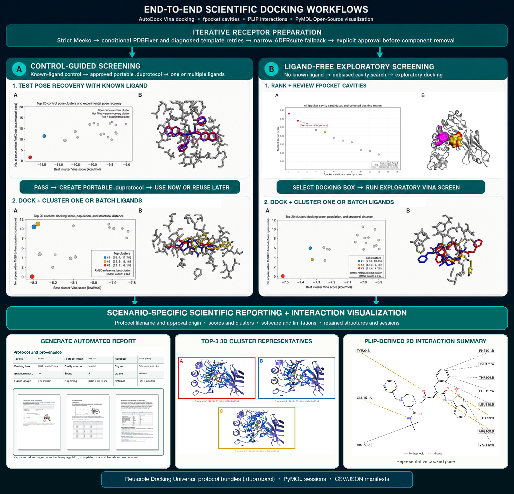

# Docking Universal

**v0.7.0 · Research preview**

Docking Universal provides fully guided, interactive docking workflows on Ubuntu and macOS, from selecting inputs through generating scientific PDF reports. It supports AutoDock Vina and QuickVina-W alongside established open-source tools for receptor and ligand preparation, site selection, docking, analysis, and visualization. Its central purpose is to gather and preserve the evidence needed for the user to make an informed, scientifically defensible docking decision.

**A Vina-family engine performs the docking; Docking Universal manages and documents the surrounding workflow.**

## What Docking Universal adds beyond Vina

AutoDock Vina and QuickVina-W are the supported docking engines: each searches an already defined box using already prepared receptor and ligand files, then returns scored poses. Docking Universal turns that calculation into a guided, reproducible scientific workflow. It prepares and checks the inputs, gathers evidence about where docking should occur, identifies agreement and disagreement between evidence sources, tests whether a protocol can recover a known pose when a control is available, analyzes the resulting poses and interactions, and retains an audit trail of how every result was produced.

| Scientific stage | What Docking Universal adds |
| --- | --- |
| **Structure and component records** | RCSB PDB retrieval, deposited-component inventories, ligand identifiers, Chemical Component Dictionary checks, and retained source records. |
| **Protein preparation** | Iterative Meeko preparation, conditional PDBFixer repair, diagnosed compatibility fallbacks, prepared receptor PDBQT output, and an explicit stop for review before any model-changing component removal. |
| **Ligand preparation** | SDF validation and splitting, molecular-graph handling, protonation and tautomer enumeration, conformer generation and pruning, charge assignment, and one prepared ligand PDBQT per compound. |
| **Site and docking-box selection** | fpocket cavity detection, descriptor collection, candidate filtering and ranking, optional related-structure ligand evidence, aligned same-site grouping, numbered and color-matched PyMOL review, one- or multi-box generation, and explicit user selection. |
| **Experimental control** | Bound-ligand pose-recovery redocking, multi-conformer and independent-seed sampling, symmetry-aware RMSD evaluation, reproducibility criteria, and failure-closed screening authorization. |
| **Reusable protocols** | Control-validated, ligand-guided exploratory, and site-guided exploratory protocols that lock the prepared receptor, selected box, search settings, evidence status, and supporting records in a portable Docking Universal `.duprotocol` bundle. |
| **Screening execution** | Guided single- or multi-compound screening with AutoDock Vina or QuickVina-W, isolated per-compound outputs, partial-failure retention, a nonzero final status when any compound fails, and normalized score collection. |
| **Pose analysis** | Cross-seed and cross-conformer symmetry-aware RMSD matrices, Butina pose clustering, cluster populations, energy-ranked representatives, and retained machine-readable tables. |
| **Interaction analysis and visualization** | PLIP-authoritative interaction calls, customized 2D interaction diagrams, color-matched 3D PyMOL pose and interaction views, and retained PyMOL sessions. |
| **Scientific reporting** | Scenario-specific PDF reports for controls, protocol creation, cavity selection, protocol reuse, and single- or multi-compound screening, with both study summaries and detailed individual-compound results. |
| **Workflow-level auditing** | Original inputs, parameters, pocket decisions, box geometry, preparation routes, failed attempts, fallbacks, structural modifications, user approvals, protocol warnings, software versions, intermediate artifacts, raw logs, and authoritative tool outputs remain available for inspection. |
| **Practical operation** | One-command environment installation, interactive Ubuntu and macOS file selection, exact-path and scripted operation, validation commands, tutorials, documented limitations, and standalone receptor or ligand preparation for other compatible software. |

**Docking Universal is therefore not a graphical replacement for an engine command line. It is the scientific preparation, validation, analysis, reporting, and audit system surrounding its supported Vina-family engines.**

### Docking engines

AutoDock Vina remains the default. QuickVina-W can be selected with `--engine qvinaw` and is intended especially for broader search regions. The engine is part of every protocol's locked scientific method: a Vina control authorizes only Vina screening, while a QuickVina-W control authorizes only QuickVina-W screening. Scores and poses from the two searches are retained separately and are not treated as interchangeable results.

When a reusable protocol is supplied, an explicit conflicting `--engine` request is rejected rather than ignored. Before either engine starts, Docking Universal also verifies that the selected receptor and docking-box files are geometrically consistent; this catches accidentally mixed inputs but does not validate the biological relevance of the selected site.

```bash
docking-universal dock --engine qvinaw --receptor receptor.pdbqt --ligands prepared_ligands --config box.conf --out results_qvinaw
```

## Why I built it: a scientist's perspective

Docking Universal began with a practical question: **how should I determine where to dock?** While building it, I learned how many consequential assumptions can sit behind an apparently straightforward result. I wanted a practical workflow that would gather the relevant evidence, make uncertainty visible, and help the user make and document the scientific decision rather than hide it inside a black box. [Read more about the design philosophy](docs/design-philosophy.md).

## Install

Clone the repository, or download and extract it, then run:

```bash
git clone https://github.com/thomaslane79-creator/docking-universal.git
cd docking-universal
bash install.sh
```

The installer creates the required isolated Conda environments and makes `docking-universal` available from any directory. Normal use does not require manual Conda activation or environment management.

```bash
docking-universal check-install
docking-universal --help
```

See the [installation guide](docs/installation.md) for updating, troubleshooting, and platform details.

## The three main workflows

These are the three commands most users need. Each launches an interactive interface on Ubuntu and macOS (Zenity/GTK on Ubuntu, with Tk as a fallback; Finder on macOS), explains requested choices, asks where to save the study, and generates a scientific PDF report. Exact paths are also accepted for headless or scripted use.

| What you want to do | Command | What you get |
| --- | --- | --- |
| Start a complete new study | `docking-universal run` | A complete control-validated or exploratory study, optionally including one or multiple new compounds, with a scientific PDF report and retained supporting files. |
| Create a reusable Docking Universal protocol | `docking-universal create-protocol` | Evidence for one or more candidate docking regions, a preliminary review report, the user-selected region or regions, a final scientific protocol report, and a reusable `.duprotocol` bundle. |
| Dock new compounds with a saved protocol | `docking-universal screen` | A complete screening report plus individual docking, clustering, 3D, and 2D interaction results for every compound. |

### Docking Universal protocol types

| Protocol type | How the docking region is established | Evidence status |
| --- | --- | --- |
| **Control-validated** | A known bound ligand is redocked and must pass pose-recovery criteria. | Supports screening with target-specific control evidence. |
| **Ligand-guided exploratory** | A ligand in the selected structure defines the region but is not redocked. | Explicitly exploratory. |
| **Site-guided exploratory** | fpocket cavity analysis defines candidate regions; optional aligned ligands from qualifying related PDB structures provide independent site evidence, and the user may select one or multiple boxes. | Explicitly exploratory; related-structure evidence supports site review but is not a pose-recovery control. |

### Evidence-led docking-region decisions

Choosing a docking box is a scientific decision, not merely a file-setting step. For site-guided protocol creation, Docking Universal can assemble several forms of evidence before asking the user to choose:

| Evidence presented | What it contributes |
| --- | --- |
| **fpocket candidates** | Independent geometric cavity hypotheses with their original scores and ranked locations. |
| **RCSB PDB sequence and structure search** | Searches related protein entities using the selected receptor chain, then verifies sequence, coverage, C-alpha structural alignment, and physical ligand contact with the accepted source chain before transferring a deposited ligand. Failed or ambiguous chain assignments are excluded and recorded. |
| **Deposited ligands from qualifying related PDB structures** | Experimentally observed ligand locations transformed into the selected receptor frame only after those sequence, structural-alignment, and ligand-contact checks. Exact-sequence and qualified related-sequence evidence remain distinguishable. |
| **Agreement between ligand evidence and fpocket** | Directly shows when a predicted cavity corresponds to an experimentally occupied region. |
| **Ligand evidence without an fpocket cavity** | Preserves an experimentally supported site as a separate selectable box instead of pretending that fpocket recovered it. |
| **Bound-ligand pose-recovery control, when available** | Tests whether the complete target-specific protocol can reproducibly recover a known pose; this is stronger evidence than cavity or related-structure correspondence alone. |

Before a site is approved, the workflow can generate a **Preliminary Pocket-Review Report (Not a Protocol)** containing the available evidence and every selectable box. The user may choose one or multiple regions, use the highest-ranked acceptable fpocket candidate automatically, or stop for further review. The final protocol report records the evidence available, the selected region geometry, whether the sources agreed, and exactly how the choice was made.

The workflow does not convert a cavity prediction or a related-structure ligand into a claim of biological validity. Missing, conflicting, partial, or excluded evidence is stated explicitly. The purpose is to give the user a transparent basis for a scientifically defensible choice—and to preserve that basis so the decision can later be inspected, challenged, or reproduced.

A `.duprotocol` contains the prepared receptor, every selected docking box, settings, provenance, and supporting evidence. It can be saved, shared, and reused by another Docking Universal installation, but it is not a general protocol format for other docking software. Exploratory use remains identified as exploratory and requires explicit user authorization.

If a protocol contains more than one selected docking site, `docking-universal screen` runs the same ligand ensemble and locked settings independently at each site. Docking, scores, pose clusters, PLIP interactions, and PyMOL sessions remain separated and labeled by site; the final report summarizes the sites together without combining them into one oversized search box.

Every guided workflow retains its report, machine-readable summaries, parameters, intermediate artifacts, and raw tool logs. Single-record SDFs, multi-record SDFs, and directories of SDF files are supported for compound screening.



## Standalone tools for other systems

Prepared receptor and ligand PDBQT files are separate from Docking Universal `.duprotocol` bundles and can be used with Vina or other compatible docking software. A complete Docking Universal study is not required.

| What you want to prepare | Command | Output |
| --- | --- | --- |
| Protein receptor and docking-site files | `docking-universal prepare-receptor protein.pdb` | Prepared receptor PDBQT, pocket/box files, and diagnostic logs. Model-changing removal requires review. |
| One or more compounds | `docking-universal prepare-ligand compounds.sdf` | One prepared ligand PDBQT per compound with preparation metadata. |

Additional component commands can also be used independently in compatible workflows:

| Task | Command | Output |
| --- | --- | --- |
| Find and review candidate pockets | `docking-universal pockets` | Ranked pocket coordinates, box structures, Vina configuration files, and a cavity report. |
| Dock prepared inputs | `docking-universal dock` | Per-compound Vina poses, logs, and a run manifest. |
| Collect docking scores | `docking-universal collect` | Tidy CSV results. |
| Compare a docked pose with a reference | `docking-universal compare-redock` | Symmetry-aware RMSD results, complexes, and an overlay scene. |
| Analyze interactions | `docking-universal interactions` | PLIP interaction records and a PyMOL scene. |
| Render existing molecular files | `docking-universal render3d` / `docking-universal depict2d` | 3D PNGs or generic 2D PNG/SVG depictions. |

## Current evidence and limitations

| Evidence | Result |
| --- | --- |
| Automated workflow checks | Installation, routing, preparation, protocol reuse, docking, analysis, visualization, and reporting pass on current Ubuntu and macOS CI systems. |
| End-to-end validation | Completed a public 1HVR/XK2 control, a held-out screen using its saved protocol, and a ligand-free 2R8N/Indinavir exploratory study. |
| Evidence-led protocol checks | Six contrasting PDB structures completed preliminary review reports, final protocol reports, and checksum-verified protocol bundles: three with qualifying aligned related-structure ligand evidence and three without it. [See the test set, alignment safeguards, and results.](docs/pocket-evidence-validation-v0.7.0.md) |
| Receptor-preparation testing | 46/50 general public structures and 39/50 deliberately difficult linked-chemistry structures produced receptor PDBQTs under the documented safety policies. |

Known preparation limitations include some covalent adducts, linked glycans, metals/heme, modified backbones, and nucleic-acid complexes. These results test workflow behavior and safeguards; they do not establish broad prospective docking accuracy or biological validity. See the [validation index](docs/validation.md) and [100-PDB receptor-preparation record](docs/receptor-preparation-validation-2026-08-21.md).

## Example scientific reports

- [Preliminary evidence and docking-box review report—not yet a protocol](docs/assets/pocket-evidence-review-example.pdf)
- [Final protocol report after a docking region is selected](docs/assets/pocket-evidence-protocol-example.pdf)
- [Complete current-style docking report](docs/assets/docking-universal-example-report.pdf)
- [Site-guided protocol report after explicit user-approved receptor-component removal](docs/assets/5KRH-user-approved-removal-cavity-report.pdf)

The first two files show the same 2R8N evidence-led workflow before and after selection: the preliminary report presents the available choices without authorizing screening, while the final report records the selected box and reusable protocol. Reports also adapt to control-validated, protocol-reuse, and single- or multi-compound studies while retaining individual compound results. The 5KRH example shows how removal of 31 standard amino-acid residues is identified as a high-severity receptor-model change; its exact inventory and raw preparation log remain in the retained study artifacts and `.duprotocol` bundle, and the warning is carried into every later screening report that reuses that protocol.

## Documentation

- [Installation and troubleshooting](docs/installation.md)
- [Guided workflows and command options](docs/guided-workflow.md)
- [Workflow examples](docs/workflow-examples.md)
- [Scientific methodology and assumptions](docs/methodology.md)
- [Validation evidence and known limitations](docs/validation.md)
- [Design philosophy](docs/design-philosophy.md)
- [GitHub essentials for scientific users](docs/assets/github-essentials-for-docking-universal.pdf)

Every command also provides `--help`.

## Scope

Docking Universal currently supports rigid-receptor structural docking with AutoDock Vina and QuickVina-W. It does not perform molecular dynamics, induced-fit refinement, or free-energy calculations, and its results require scientific interpretation.

## License and citation

MIT. See [LICENSE](LICENSE). If Docking Universal contributes to your work, cite the repository release and the underlying scientific tools used. Machine-readable citation metadata is provided in [CITATION.cff](CITATION.cff); generated reports include applicable software versions and references.
