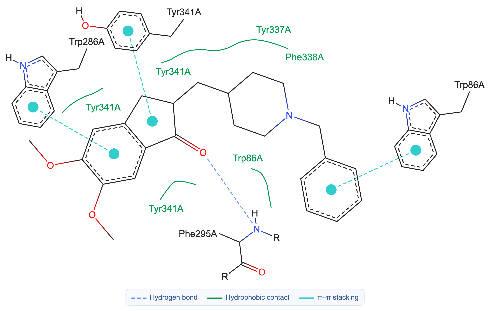

# 2D interaction-diagram reference design

Status: **approved visual reference for GUI implementation** (2026-09-13).

This document freezes the intended Docking Universal protein–ligand interaction
diagram before the renderer is promoted from the local prototype into the GUI.
The reference is inspired by PoseEdit/PoseView presentation, but it is generated
locally from retained ligand coordinates and PLIP interaction records. It does
not call PoseEdit, PoseView, or any other web service.

The illustrated complex is the public AChE–donepezil structure 4EY7. Private
docked structures and their derived diagrams are deliberately excluded from the
repository under the [data-privacy boundary](data-privacy.md).

## Scientific and visual contract

- PLIP remains the authority for whether an interaction exists and for its
  interaction class. Diagram geometry must not reclassify a contact.
- The ligand is drawn from its retained chemically typed structure so bond
  orders, aromaticity, heteroatoms, and stereochemical marks are preserved.
- An interacting protein residue is shown with the relevant complete side chain.
  A main-chain interaction instead includes the relevant backbone atoms.
- Hydrogen bonds are light-blue dashed atom-to-atom connectors.
- Pi interactions use PoseEdit-style cyan centroid markers and dashed centroid
  connectors. Their legend entry is `π–π stacking`.
- Hydrophobic contacts use smooth green boundary segments. Every displayed
  segment has its associated residue label or labels close enough to make the
  association unambiguous.
- Repeated contacts may share a smooth boundary segment, but residues are not
  globally deduplicated across unrelated segments.
- PLIP distance and angle values are retained in structured evidence but are not
  printed on the default diagram. Apparent 2D distance is layout geometry and
  must never be presented as the measured 3D distance.
- Fractional oxygen labels such as `O-1/2` are omitted because they add clutter
  without changing the PLIP classification.
- The legend is centered below the molecular drawing and contains only the
  interaction types actually present.

## Layout contract

Layout is deterministic for identical inputs. It begins with the ligand's 2D
chemical depiction and uses the retained 3D pose to project the protein-facing
direction of each contact. Full residue fragments are placed around the ligand;
labels may move along their assigned boundary but may not become detached from
it visually.

Collision handling must consider more than label-to-label rectangles. Its
obstacles include ligand and residue atoms, bonds, interaction connectors,
hydrophobic curves, centroid symbols, and the legend. Placement candidates may
use either side of a curve and bounded movement along its tangent. Text size is
measured with the actual rendering font rather than estimated from character
count.

The renderer must satisfy all of these rules:

1. No label overlaps another label, ligand, residue fragment, interaction line,
   hydrophobic segment, or pi marker.
2. A hydrophobic label stays near its own green segment and is not ambiguous
   with a neighboring segment.
3. Green boundary segments are smoothly sampled curves, not angular leader
   lines or multiple spokes converging on the ligand.
4. The legend is positioned immediately below the lowest diagram element before
   the final image bounds are calculated.
5. The exported SVG/PNG is cropped from the rendered content bounds with a
   target outer margin of 10 px. Raster antialiasing may extend the detected
   non-white top edge by up to 3 px. Unused source-canvas space is never retained
   above or below the result.
6. If a valid collision-free layout cannot be found, the renderer reports a
   layout failure. It must not silently emit an overlapping figure while claiming
   zero overlaps.

## Validation contract

Before GUI integration, exercise at least five interaction-dense retained poses
plus a public pi-rich case. The current local prototype was checked against five
docked poses and public 4EY7. All six produced zero detected text collisions;
their final non-white vertical margins were 10–13 px at the top and 10 px at the
bottom. The private fixtures and images remain local and must not be committed.

Automated renderer tests should assert:

- presence and labeling of every expected PLIP interaction;
- zero remaining geometry collisions and zero ambiguous label-to-curve links;
- legend contents derived from the interaction classes present;
- deterministic output for a fixed fixture;
- content-bound crop margins within the accepted tolerance; and
- explicit failure when constraints cannot be satisfied.

The eventual GUI should initially show the lowest-energy pose per cluster, then
generate the same view lazily for every pose in expanded review. While a diagram
is being generated, the image area shows a loading state rather than the prior
pose's image.
